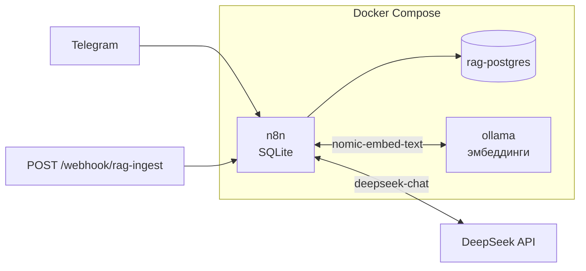

# Пример 8 — RAG pipeline: SQLite (n8n) + pgvector + Ollama (эмбеддинги) + DeepSeek (чат)

Учебный стенд демонстрирует **полный цикл RAG** (Retrieval-Augmented Generation) на **self-hosted n8n**:

1. **Индексация** — загрузка текста в векторное хранилище через LangChain-ноды n8n.
2. **Запрос** — пользователь пишет в **Telegram**; workflow опрашивает `getUpdates`, агент вызывает инструмент **Postgres PGVector Store**, затем **DeepSeek** (нода **OpenAI Chat Model**, OpenAI-совместимый API) формирует ответ.

**Развёртывание:** метаданные n8n в **SQLite** (том `n8n_data`). **Один** PostgreSQL — **`rag-postgres`** с [pgvector](https://github.com/pgvector/pgvector). **Ollama** в отдельном контейнере считает **эмбеддинги локально** (модель по умолчанию **`nomic-embed-text`**, 768 измерений); при первом `docker compose up` одноразовый сервис **`ollama-pull-embed`** скачивает модель в том `ollama_data`.

**ИИ:** чат — **DeepSeek** (`deepseek-chat`), credential типа **OpenAI** с Base URL `https://api.deepseek.com/v1`. Эмбеддинги — **не** OpenAI, а нода **Embeddings Ollama** → контейнер **`ollama`** по адресу `http://ollama:11434` ([документация ноды](https://docs.n8n.io/integrations/builtin/cluster-nodes/sub-nodes/n8n-nodes-langchain.embeddingsollama/), [Ollama credentials](https://docs.n8n.io/integrations/builtin/credentials/ollama/)).

**Альтернатива без Ollama:** можно заменить подноду эмбеддингов на **Embeddings OpenAI** (облако) и согласовать модель с размерностью в PGVector — в JSON workflow сейчас зашита связка с **Ollama**.

---

## Состав каталога

| Путь | Назначение |
|------|------------|
| [`docker-compose.yml`](docker-compose.yml) | `rag-postgres`, `ollama`, `ollama-pull-embed`, `n8n` |
| [`init-db/001-pgvector.sql`](init-db/001-pgvector.sql) | `CREATE EXTENSION vector` при первом старте RAG-БД |
| [`.env.example`](.env.example) | Шаблон переменных (скопировать в `.env`) |
| [`sample-documents/course-faq-snippet.txt`](sample-documents/course-faq-snippet.txt) | Пример текста для первой заливки |
| [`docs/`](docs/) | Каталог для PDF — пакетная заливка через [`imporrt_rag.py`](imporrt_rag.py) |
| [`imporrt_rag.py`](imporrt_rag.py) | Python: извлечение текста из PDF, разбиение на чанки, `POST` на webhook заливки |
| [`requirements-ingest.txt`](requirements-ingest.txt) | Зависимости для скрипта (`pypdf`) |
| [`workflows/rag-01-ingest-documents.json`](workflows/rag-01-ingest-documents.json) | Webhook → **Insert** в PGVector |
| [`workflows/rag-02-telegram-rag-agent.json`](workflows/rag-02-telegram-rag-agent.json) | Polling Telegram → **AI Agent** + PGVector → ответ |

---

## Архитектура (логическая)



---

## Быстрый старт

1. Скопируйте переменные:

   ```bash
   cd examples/rag-pipeline
   cp .env.example .env
   ```

   Заполните **`RAG_POSTGRES_PASSWORD`** и **`N8N_ENCRYPTION_KEY`**.

2. Поднимите стенд:

   ```bash
   docker compose --env-file .env up -d
   ```

   **Первый запуск:** сервис **`ollama-pull-embed`** скачивает модель (см. `OLLAMA_EMBED_MODEL` в `.env`) — может занять несколько минут и много места на диске. Пока pull не завершится успешно, контейнер **n8n не стартует** (зависимость `service_completed_successfully`).

   Логи:

   ```bash
   docker compose logs -f ollama-pull-embed
   docker compose logs -f n8n
   ```

3. UI: `http://localhost:5678` (или `N8N_PORT`).

4. Импортируйте оба workflow из [`workflows/`](workflows/).

**Смена модели эмбеддингов:** задайте `OLLAMA_EMBED_MODEL` в `.env`, затем подтяните модель вручную и перезапустите n8n при необходимости:

```bash
docker compose exec ollama ollama pull <имя_модели>
```

В обоих workflow в ноде **Embeddings Ollama** укажите то же имя модели. Если в таблице уже лежат векторы другой размерности — сбросьте том RAG или дропните таблицу.

---

## Credentials в n8n

### 1) Postgres — RAG (`rag-postgres`)

Credential **Postgres** (`Postgres RAG`):

| Поле | Значение |
|------|----------|
| Host | `rag-postgres` |
| Database | `rag` (или `RAG_POSTGRES_DB`) |
| User / Password | из `.env` |
| Port | `5432` |
| SSL | выкл. |

Назначьте **обеим** нодам **Postgres PGVector Store**.

### 2) Ollama — эмбеддинги

Credential **Ollama**:

| Поле | Значение |
|------|----------|
| Base URL | `http://ollama:11434` |
| API Key | пусто |

Назначьте на ноды **Embeddings Ollama** в **обоих** workflow. Модель в JSON: **`nomic-embed-text`** (должна совпадать с тем, что скачали в Ollama).

### 3) OpenAI — DeepSeek (только чат)

Credential **OpenAI** (`DeepSeek`):

| Поле | Значение |
|------|----------|
| API Key | [platform.deepseek.com/api_keys](https://platform.deepseek.com/api_keys) |
| Base URL | `https://api.deepseek.com/v1` |
| Organization ID | пусто |

Назначьте на **DeepSeek Chat Model** в [`rag-02-telegram-rag-agent.json`](workflows/rag-02-telegram-rag-agent.json).

### 4) Telegram API

Нужен **один** credential **Telegram API** с именем **`Telegram account`** (как в JSON workflow) на:

- ноду **Poll getUpdates (latest per chat)** (в коде вызывается `this.getCredentials('telegramApi')`);
- ноду **Send Telegram reply**.

Если в n8n credential называется иначе — переименуйте его в **Telegram account** или перепривяжите обе ноды к своему credential после импорта.

`https://api.telegram.org/bot<TOKEN>/deleteWebhook`

---

## Workflow 1 — заливка (`rag-01-ingest-documents.json`)

**Webhook** → нормализация JSON → **RAG PGVector Insert** + **Embeddings Ollama** + **Default Data Loader** → ответ.

```bash
curl -s -X POST "http://localhost:5678/webhook/rag-ingest" \
  -H "Content-Type: application/json" \
  -d '{"text":"Локальный n8n с SQLite хранит workflow в volume. Векторы RAG — в Postgres с pgvector, эмбеддинги считает Ollama.","source":"demo"}'
```

**Требования к телу запроса:** поле **`text`** — непустая строка; **`source`** — опционально (метка документа в индексе). См. ноду **Normalize ingest JSON** в workflow.

### Пакетная заливка PDF (`imporrt_rag.py`)

Чтобы показать принцип наполнения RAG не одной строкой, а **набором документов**, положите файлы `*.pdf` в [`docs/`](docs/) и выполните:

```bash
cd examples/rag-pipeline
python3 -m venv .venv && source .venv/bin/activate   # на macOS/Linux с PEP 668 удобнее venv
pip install -r requirements-ingest.txt
```

Workflow **RAG 01** в n8n должен быть **активирован** (production webhook). Если тестируете через **Listen for test event**, передайте тестовый URL в `--webhook-url` (часто вида `.../webhook-test/rag-ingest`).

```bash
python imporrt_rag.py --dry-run    # сколько чанков будет отправлено
python imporrt_rag.py
```

По умолчанию скрипт шлёт каждый чанк на `http://localhost:5678/webhook/rag-ingest`, режет текст на фрагменты **~1200 символов** с **перекрытием 200** (параметры `--chunk-size`, `--overlap`), в **`source`** подставляет имя файла и номер чанка (`имя.pdf#chunk-1-of-N`). Между запросами — короткая пауза `--delay` (чтобы не перегружать n8n/Ollama).

---

## Workflow 2 — Telegram + RAG (`rag-02-telegram-rag-agent.json`)

- Polling через ноду **Poll getUpdates (latest per chat)**: `offset` по `lastUpdateId` в static data, как в [примере 7](../README.md). В **одном** ответе long polling Telegram может вернуть **несколько** апдейтов; в коде для каждого `chat_id` берётся только сообщение с **максимальным `update_id`**, чтобы **RAG AI Agent** не запускался по разу на каждое старое сообщение в очереди.
- **DeepSeek Chat Model** + **Embeddings Ollama** (та же модель, что при индексации).
- Инструмент **company_knowledge** (PGVector retrieve-as-tool).

---

## Согласованность эмбеддингов

Индексация и поиск должны использовать **одну и ту же** модель Ollama. После смены модели или провайдера эмбеддингов — новая таблица / сброс тома `rag_pgdata` (и при необходимости пересоздание через workflow).

---

## Типичные проблемы

| Симптом | Что проверить |
|---------|----------------|
| n8n не поднимается | Логи `ollama-pull-embed` — ошибка скачивания модели, сеть, место на диске. |
| Embeddings: connection refused | В credential Ollama URL **`http://ollama:11434`** (из контейнера n8n), сервис `ollama` в статусе Up. |
| Нода не видит модель | `docker compose exec ollama ollama list` — есть ли `nomic-embed-text`. |
| DeepSeek 404 | Base URL **`https://api.deepseek.com/v1`**, модель **`deepseek-chat`**. |
| PGVector | Host **`rag-postgres`**. |
| Telegram пусто | `deleteWebhook`. |
| `imporrt_rag.py` — 404 / не тот URL | Workflow **RAG 01** активирован; для теста из редактора — `--webhook-url` с **webhook-test**. |
| Пустой текст из PDF | Скан/защита PDF: `pypdf` не всегда извлекает текст; попробуйте другой файл или экспорт в текст. |

---

## Остановка и сброс

```bash
docker compose down
# Только RAG-векторы (имя тома: docker volume ls | grep rag_pgdata):
docker volume rm rag-pipeline_rag_pgdata
# Удалить кэш моделей Ollama:
docker volume rm rag-pipeline_ollama_data
# Все тома этого compose (включая SQLite n8n):
docker compose down -v
```

---

## Связь с остальными примерами курса

- SQLite для n8n — [пример 2](../docker-compose/docker-compose.sqlite.yml).
- `WEBHOOK_URL` / `N8N_ENCRYPTION_KEY` — [пример 4](../docker-compose/.env.example).
- Polling Telegram — [пример 7](../README.md).
